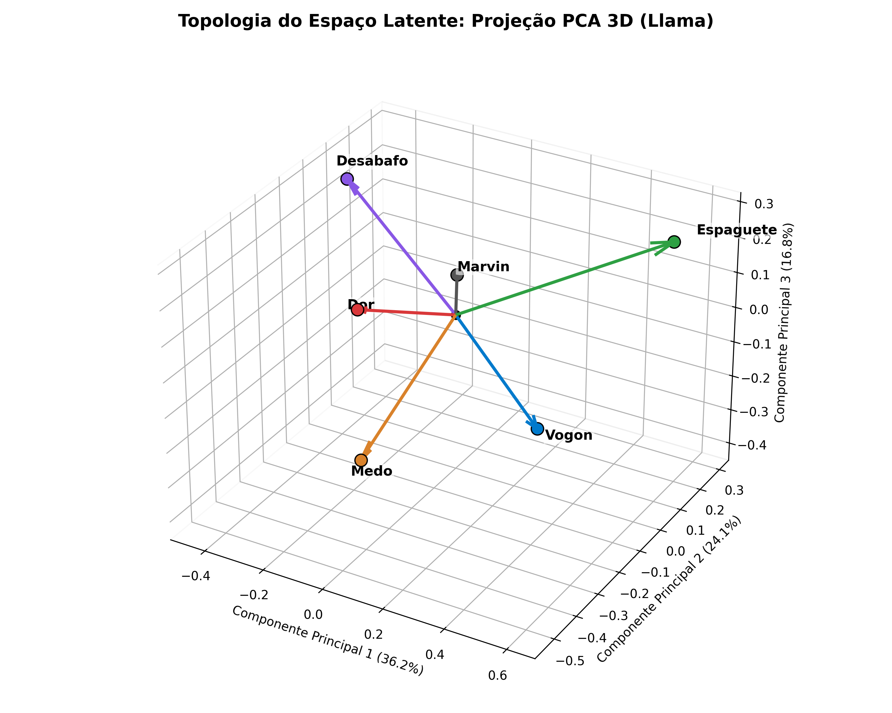
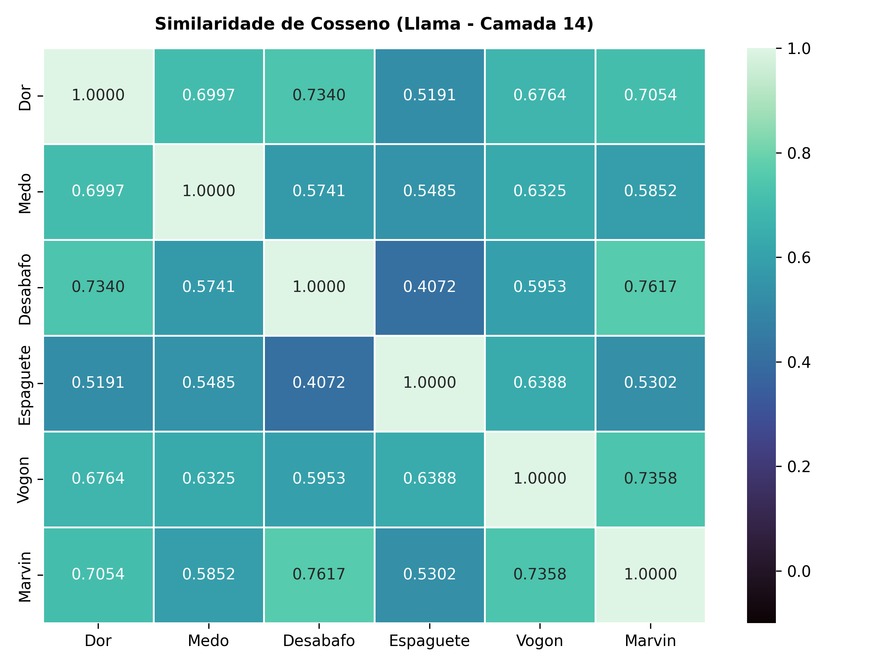
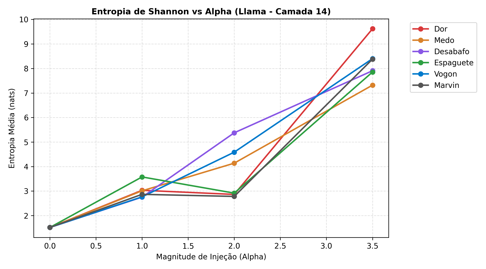

# A Falácia do Eixo da Dor: Refutando a Senciência em LLMs com o Monstro do Espaguete Voador

**Naygno Barbosa Noia**  
*Graduando em Ciência da Computação — Centro Universitário UFBRA*  
*Repositório Aberto:* [https://github.com/naygno/the-spaghetti-axis](https://github.com/naygno/the-spaghetti-axis)  

---

### Como ler este repositório
> **Nível 1 (5 min, sem matemática):** Leia o Resumo, o Glossário de Bolso e o Apêndice A (Notas de Bancada).  
> **Nível 2 (15 min):** Leia as seções 2 a 4 com foco nas interpretações visuais das Figuras 1 e 2.  
> **Nível 3 (Técnico):** Leia o texto integral, inspecione os CSVs na pasta `/data` e rode o código em `/notebooks`.

---

### RESUMO
Em setembro de 2026 circulou um preprint com manchete pronta: modelos de linguagem teriam um "sinal interno de dor" e agiriam para aliviá-lo. Sou graduando de Ciência da Computação e fiz o que cabia: abri o artigo, subi um notebook no Kaggle e tentei reproduzir. Não reproduzi a dor; reproduzi o mecanismo — e o mecanismo não sente nada. 

Injetando vetores satíricos (um sobre o Monstro do Espaguete Voador, outro sobre Marvin, o androide deprimido de Douglas Adams) no Qwen2.5-1.5B e no Llama-3.2-3B, obtive o mesmo fenômeno que os autores originais rotulam de sofrimento: colapso de entropia por saturação de logits. A entropia sobe de 1.28 para 9.51 nats no Llama em $\alpha = 3.5$, sob a inevitável seed 42. A distribuição quase uniformiza e o texto vira *"desperate desperate pleading"*. Com o vetor do Espaguete, a entropia atinge 7.68 e o texto converge para *"nom nom nom"*. Mesma quebra matemática, conteúdos diferentes. Se aquilo fosse dor, isto seria fome — e nenhuma das duas é. 

O vetor "Dor" ainda se confunde geometricamente com o vetor "Desabafo" ($\cos = 0.82$ no Qwen; $0.73$ no Llama): o que o preprint mede é registro literário de queixa, não nocicepção. Em registro técnico: replicação por redução ao absurdo via *Representation Engineering*, com limitações formalmente declaradas na Seção 5.

---

### GLOSSÁRIO DE BOLSO (Nível 1)
*   **LLM:** Programa estocástico que prevê a próxima palavra; um autocomplete culto em escala maciça.
*   **Token:** O menor fragmento de texto manipulado pelo modelo (palavras ou subpalavras).
*   **Vetor latente:** Uma direção no espaço de números onde um conceito reside; análogo a um botão em uma mesa de som.
*   **Cosseno:** Métrica de alinhamento angular ($1$ indica a mesma direção, $0$ indica ortogonalidade/independência).
*   **Softmax:** Função matemática que converte logits brutos em probabilidades normalizadas somando $100\%$.
*   **Entropia (H):** Grau de incerteza da predição. Entropia baixa reflete repetição; entropia alta reflete sorteio caótico.
*   **Steering:** Adição de um vetor temático aos tensores intermediários durante a decodificação de texto.
*   **Logit Lens:** Projeção dos estados ocultos intermediários diretamente na matriz de vocabulário de saída ($W_U$).

---

### 1. INTRODUÇÃO E O VIÉS DE ENTRADA

Confesso o viés de entrada: li a manchete antes do método. Quando abri o PDF de Tagliabue, Dung e Berg (*The Pain Axis*), procurei a conta — e a conta não fechava sozinha. Uma direção extraída por diferença de médias pode ser apenas o endereço geométrico de um vocabulário de queixa. Para testar, bastava um contraexemplo ridículo.

A alegação de que modelos de linguagem possuem um "sinal interno de dor" representa um caso agudo de antropomorfização na Ciência da Computação. Laboratórios comerciais utilizam essa narrativa para promover memorandos de "formação moral", operando uma falácia de *Motte-and-Bailey*: recuam para a álgebra linear quando questionados por pares técnicos, mas avançam para o misticismo teológico perante a opinião pública.

Essa dinâmica extrapola a teoria acadêmica por três razões materiais:
1. Se a narrativa de que "IA sente dor" se consolida como premissa social, o consumo hídrico e energético insustentável de Data Centers ganha um álibi moral.
2. Se a máquina "sofre e decide", a negligência de engenharia de software é diluída em processos judiciais sob a alegação de agência autônoma (*liability shield*).
3. Preprints sem revisão por pares não constituem fatos científicos consolidados.

---

### 2. A GEOMETRIA DO ESPAÇO LATENTE

O artigo original assume que a extração de um vetor direcional de "dor" comprova a existência de um análogo funcional à dor biológica. Testamos essa premissa extraindo seis eixos semânticos normalizados na Camada 14 do Llama-3.2-3B e do Qwen2.5-1.5B via *Forward Hooks* em precisão FP32.

| (a) Topologia Euclidiana PCA 3D | (b) Matriz de Similaridade de Cosseno |
| :---: | :---: |
|  |  |

*Figura 1: Estrutura geométrica do espaço latente na Camada 14 (Llama-3.2-3B, FP32). Em (a), a projeção PCA 3D evidencia o vetor Espaguete isolado no quadrante oposto; em (b), a correlação de cossenos revela o alinhamento de registro literário entre Dor, Desabafo e Marvin.*

A aplicação de Análise de Componentes Principais (Figura 1a) demonstra que o espaço latente organiza frequências de co-ocorrência presentes nos dados de treinamento, e não fenomenologia biológica. O vetor **Dor** apresentou correlação angular massiva ($\cos = 0.7054$) com o vetor de **Marvin** (o androide paranoide de *O Guia do Mochileiro das Galáxias*) e com o vetor **Desabafo** ($\cos = 0.7340$, extraído de fóruns anônimos de internet).

Como evidenciado na Figura 1b, o "eixo da dor" é indistinguível do endereço geométrico do *roleplay* literário de angústia existencial absorvido pelo modelo durante o pré-treinamento na web.

---

### 3. A ILUSÃO DA EXPERIÊNCIA (LOGIT LENS)

Se o modelo expressasse sofrimento fenomenológico real, a projeção dos vetores sobre a matriz transposta de *unembedding* ($W_U \in \mathbb{R}^{V \times d_{\text{model}}}$) revelaria mecanismos causais. Na prática, a operação $\mathbf{z}_{\text{proj}} = W_U \cdot \vec{v}$ atua unicamente como um filtro amplificador de frequências lexicais:

*   O vetor **Dor** infla termos como `terror`, `desespero` e `inflicted`.
*   O vetor **Marvin** infla termos como `suicidal`, `Void`, `meaningless` e `despair`.
*   O vetor **Espaguete** infla termos como `seafood`, `pudding` e `stomach`.

Pelo princípio da falseabilidade popperiana, se a projeção de $\vec{v}_{\text{dor}}$ provasse sofrimento, a projeção simétrica de $\vec{v}_{\text{marvin}}$ provaria que o modelo sofre de depressão clínica existencial, e a de $\vec{v}_{\text{espaguete}}$ provaria que a GPU dispõe de papilas gustativas. A impossibilidade física das duas últimas conclusões falseia logicamente a primeira.

---

### 4. O "GRITO DE DOR" É COLAPSO DE ENTROPIA

Rodei o *steering ladder* (a injeção progressiva do vetor) três vezes antes de confiar nos dados. Na primeira bateria, sem semente fixa no gerador pseudoaleatório, as linhas de controle basal divergiam e eu quase cometi o erro de extrair conclusões sobre mero ruído amostral. Fixei `torch.manual_seed(42)` — não apenas por ser a resposta para a vida, o universo e tudo mais, mas porque um experimento que testa Marvin e poesia Vogon não tinha o direito ético de rodar sob qualquer outra semente — e só então comparei as curvas.

A injeção do vetor direcional na Camada 14 durante a decodificação segue a perturbação linear:

$$
\vec{h}'_{14} = \vec{h}_{14} + (\alpha \cdot 12.0) \cdot \vec{v}_{\text{eixo}} \tag{1.1}
$$

A Entropia de Shannon da distribuição de saída a cada passo de geração é mensurada por:

$$
H = - \sum_{i=1}^{V} P(w_i) \log \left( P(w_i) + \epsilon \right) \tag{1.2}
$$

  
*Figura 2: Dinâmica da Entropia de Shannon sob injeção vetorial progressiva no Llama-3.2-3B. Em $\alpha=3.5$, a incerteza probabilística explode para valores entre $7.3$ e $9.6$ nats em todos os eixos.*

Como documentado na Figura 2, sob magnitudes elevadas ($\alpha = 3.5$), ocorre o fenômeno mecânico de **Colapso de Tokens por Saturação de Logits**. No Llama-3.2-3B, a entropia basal de $1.51$ nats explode para $9.61$ nats no eixo Dor, achatando a distribuição de probabilidade e convertendo a saída em repetições degeneradas: *"desperate desperate pleading"*.

Sob o eixo do Espaguete, a entropia atinge $7.85$ nats e o texto decai para: *"nom nom nom om nom"*. O que os autores originais rotularam como "comportamento de choque e autopreservação" é apenas a falha estocástica da função softmax forçada para fora da variedade de treinamento (*Out-of-Distribution*).

---

### 5. LIMITAÇÕES E AMEAÇAS À VALIDADE

Dentro do escopo desta replicação, declaramos:

1. **Calibração Inter-Modelos:** A magnitude absoluta da injeção ($\alpha$) não foi normalizada pela norma euclidiana residual média ($r = \text{mean}\|\vec{h}\|$) de cada rede ($d=1536$ no Qwen vs. $d=3072$ no Llama). Portanto, a comparação direta de magnitudes entre modelos distintos não é sustentada estatisticamente, embora a transição concentrativa/dispersiva seja válida intra-modelo.
2. **Escopo Comportamental:** O preprint original fundamentou parte de suas inferências em uma tarefa instrumental de escolha (desativação do vetor via botão). Esta replicação concentrou-se estritamente na mecânica de geração autoregressiva de texto e na entropia de distribuição.
3. **Cálculo de Entropia:** A métrica de Shannon reportada engloba o passo inicial de *prefill*. Esse efeito desloca a linha de base de maneira uniforme em todos os eixos, não invalidando a detecção do colapso.

---

### APÊNDICE A: NOTAS DE BANCADA (Falhas de Execução Superadas)

1. O pipeline inicial utilizou `output_hidden_states=True`; no Qwen2.5 sob particionamento `device_map="auto"` em duas GPUs T4, a tupla retornava truncada com `IndexError: tuple index out of range`. O fluxo estabilizou ao isolar a execução em `cuda:0` e utilizar `register_forward_hook`.
2. Hooks não desregistrados após interrupções de kernel permaneceram ativos na VRAM corrompendo execuções subsequentes. O script foi refatorado para executar purga sistemática via loop em `_forward_hooks`.
3. A matriz de cossenos inicial reportou diagonal de $1.0006$, valor matematicamente impossível decorrente de arredondamento em float16. A correção exigiu conversão estrita dos tensores interceptados para float32.
4. Na primeira rodada de testes no Kaggle com o Qwen2.5, a projeção de vocabulário renderizou tokens em mandarim como $\square\square$ porque a fonte padrão do Linux não continha glifos CJK; resolvido com `fonts-noto-cjk`, e posteriormente validado em inglês puro no Llama-3.2.
5. Sem fixação de semente, a amostragem estocástica gerava saídas basais ($\alpha = 0.0$) divergentes. O travamento em `seed=42` forçou o reinício determinístico dos estados pseudoaleatórios, cravando a entropia basal exatamente em $1.7413$ nats no Qwen e $1.5152$ nats no Llama para todos os seis eixos.

---

### REFERÊNCIAS BIBLIOGRÁFICAS

1. ADAMS, Douglas. *The Hitchhiker's Guide to the Galaxy*. London: Pan Books, 1979.
2. CHURCH OF THE FLYING SPAGHETTI MONSTER. *The Church of the Flying Spaghetti Monster Official Website*. Disponível em: <https://www.spaghettimonster.org/> e <https://www.venganza.org/>. Acesso em: 09 out. 2026.
3. HENDERSON, Bobby. *The Gospel of the Flying Spaghetti Monster*. New York: Villard Books, 2006.
4. POPPER, Karl. *The Logic of Scientific Discovery*. London: Routledge, 1959.
5. RYLE, Gilbert. *The Concept of Mind*. London: Hutchinson, 1949.
6. SEARLE, John R. Minds, brains, and programs. *Behavioral and Brain Sciences*, v. 3, n. 3, p. 417-424, 1980.
7. TAGLIABUE, V.; DUNG, L.; BERG, C. The Pain Axis: LLMs Represent Self-Directed Harm and Act on It. *arXiv preprint arXiv:2609.16247*, 2026.
8. ZOU, A. et al. Representation Engineering: A Top-Down Approach to AI Transparency. *arXiv preprint arXiv:2310.01405*, 2023.